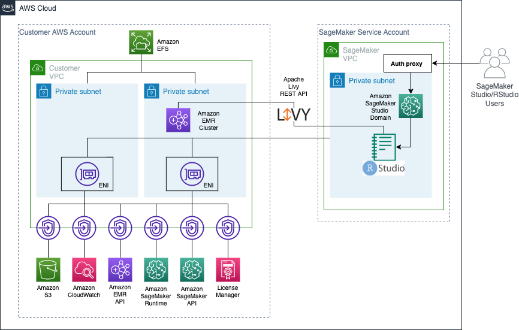

# Connect Amazon SageMaker RStudio to Amazon EMR
This blog post describes how to connect Amazon SageMaker RStudio to Amazon EMR. With this setup we can run analytics at scale from SageMaker RStudio. 

## Architecture

This repository is apart of the following blog: [Insert Blog Link]. In this blog we will launch infrastructure to create an RStudio Domain and an EMR cluster. From there we will create a custom image for our SageMaker domain connecting the two.  

## Security

See [CONTRIBUTING](CONTRIBUTING.md#security-issue-notifications) for more information.

## License

This library is licensed under the MIT-0 License. See the LICENSE file.

